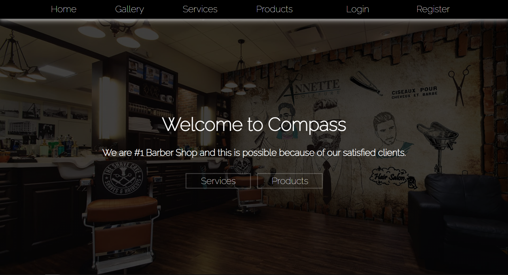

# Barber Shop React

Welcome to the Barber Shop React repository! This project is a web application built with React.js for managing a barber shop's appointments and services.

## Table of Contents

- [Introduction](#introduction)
- [Usage](#usage)
- [Features](#features)
- [Getting Started](#getting-started)
- [How to run the Application](#how-to-run)
- [After Successful run](#successful-run)
- [Existing Accounts](#existing-accounts)
- [Project Structure](#project-structure)
- [Client Dependencies](#client-dependencies)
- [DEV Dependencies](#dev-dependencies)
- [Server](#server)
- [License](#license)

## Introduction

This project is aimed at providing a modern and user-friendly UI/UX. 

## Usage

This project is a React application that It's purpose is to meet the criteriа of the SoftUni React Final Exam.

## Features
- **Dynamic Navigation:** Navigation link depends on authentication.
- **CRUD:** Authenticated users have all CRUD operations while guests has only read.
- **User Authentication:** Secure login and registration for both admin and clients.
- **Admin Panel** Admin can add products to the server and delete.
- **Service Listing:** Display available services with details.
- **Product Listing:** Display available products with details.
- **Gallery:** Catalog page where are displayed all photos created by the clients.
- **Intuitive UI:** User-friendly interface for easy navigation.

## Getting Started

To run this project locally, follow these steps:

1. Clone this repository:

   ```bash
   git clone https://github.com/superGemHere/Barber-Shop-React.git
2. Open cloned repository
3. Navigate to the project directory: 

    ```
     cd .\Barber-Shop-React

4. Navigate to the client directory: 

     ```
     cd .\client\
    
5. Install dependencies on client: 

     ```
     npm install

    
6. Open new terminal and navigate to server2 directory: 

     ```
     cd .\server 2\
    
7. Install dependencies on server: 

     ```
     npm install

## How to run

1. Go to your client terminal and type:

    ```
    npm run dev
2. Go to your server terminal and type:

    ```
    node server.js

## Successful run

1.  After successful running locally you can access the site trough browser at:

    ```
    http://localhost:5173/

<h2>There you will be wellcome with the home page</h2>



## Existing Accounts

The service is initialized with three users, which can be used for immediate testing:
* peter@abv.bg : 123456
* george@abv.bg : 123456

<p>Accout with permission for admin panel: </p>

* admin@abv.bg : admin

## Project Structure
The project structure is organized as follows:

**src/:** Contains the source code.

**components/:** Reusable React components.
 <h2> Components Structure </h2>

Every component is encapsulated into his own folder with his own css.

<h2> Custom Hooks </h2>


**useForm.js** Hook for controlled form.

**userPersistedState.js:** Makes persisted state using local storage.

**useUpdateForm.js:** Hook for controlled update form.

<h2> Services  </h2>

**authService.js** Authentication API services.

**commentService.js** Comment API services.

**postService.js** Photo related API services.

**productService.js** Product related API services for admin account.

<h2> Custom Library  </h2>

**request.js** Custom request function for easier API calls.


<h2> Main Files </h2>

**App.js:** Main application component.

**index.js:** Entry point of the application.

**public/:** Static assets.

    
## Client Dependencies

**react** .v 18.2.0

**react-dom** .v 18.2.0

**react-router-dom** .v 6.18.0

**react-social-icons** .v 6.18.0


## Dev Dependencies

 **"@types/react": "^18.2.15"**

**"@types/react-dom": "^18.2.7"**

**"@vitejs/plugin-react-swc": "^3.3.2"**

**"eslint": "^8.45.0"**

**"eslint-plugin-react": "^7.32.2"**

**"eslint-plugin-react-hooks": "^4.6.0"**

**"eslint-plugin-react-refresh": "^0.4.3"**
    
**"vite": "^4.4.5"**

## Server

<h4> This server is made by <a href="https://softuni.bg/">Software University</a> </h4>
You can read server's <a href="https://github.com/softuni-practice-server/softuni-practice-server#readme">README.md</a>

## License

This project is licensed under the <a href="https://opensource.org/license/mit/">MIT License</a>.

**Feel free to customize the content based on the specific details of your project and add any additional sections you find necessary.**